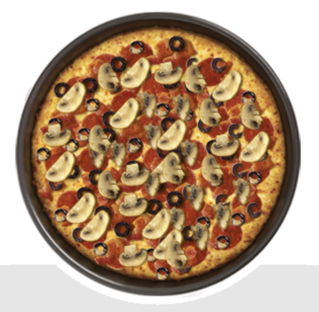

<center>
<h1> Sets </h1>
</center>

Your stomach starts growling after that last tutorial. You look at the clock but its already way past breakfast so you really shouldn't eat waffles at this time. You flick on the TV and see a Dominoes commercial and now you are craving a pizza. 

You get on the your phone, open the Dominoes app and start creating your pizza. You decide to go with build your own 4 topping pizza. After you finish and submit your order, you get a call from Dominoes and they say, "Hey we just got your order for that 4 topping pizza, does it matter what toppings go first?" You say, "Uhhh no just as long as it is on the pizza." He replies, "So you are saying order doesn't matter?" "Yes that is what I am saying." 



Hmmm that sounds like a <strong>set data structure</strong> to me!

That long intro was to introduce our new data structure tutorial <strong>sets</strong>! There are a few key elements that sets is unique to other data structures, let's go over them:

* Order is not important
* No duplicates allowed
* Store info in a set to make it efficient
* Iterable
* Mutable

Lets see how it looks in code:
```python
# Hey look its 3 out of the 4 toppings of our pizza
pizzaSet = set(["Pepperoni", "Bacon", "Mushrooms"])
print(pizzaSet)

#adding our final topping
pizzaSet.add("Olives")
print(pizzaSet)
```
<strong>Output:</strong>
```python
{'Mushrooms', 'Bacon', 'Pepperoni'}
{'Olives', 'Mushrooms', 'Bacon', 'Pepperoni'}
```
Notice when we hit the play button again:
```python
{'Mushrooms', 'Bacon', 'Pepperoni'}
{'Mushrooms', 'Olives', 'Bacon', 'Pepperoni'}
```
Woah, 'Mushrooms' and 'Olives' changed places. And why is that? That's right, because order doesn't matter!

## Hashing

Wait like hashbrowns? No, I don't have to make everything about food in my tutorials, okay? Hashing is basically just the way we use the set, we are able to add, remove, and test for membership in O(1) time, we'll come back to performance in a second.

For strings and floats we can use this formula:

```
index(n) = hash(n) % sparse_list_size
```
The <strong>hashing function</strong> will convert non-integers into integers so that modulo operator can be used.

The values returned by the hash function will vary everytime you run a python script, but they will be consistent while you are running a script to completion.

Unfortunately, not every situation can be hashed. Luckily we have ways of dealing with these issues when they arise.

* Step 1: <strong>Stopping being a baby</strong>

* Step 2: <strong>Open addressing:</strong>

&nbsp;&nbsp;&nbsp;&nbsp;&nbsp;&nbsp;&nbsp;&nbsp;&nbsp; - This tells us to move to the next available space. Kind of like a board game when you aren't suppose to share a space with another player.

* Step 3: <strong> Chaining</strong>:

&nbsp;&nbsp;&nbsp;&nbsp;&nbsp;&nbsp;&nbsp;&nbsp;&nbsp; - We can make a list a of values that occupy the same space, this doesn't create clusters of conflict.

## Performance

|Set Operation| Performance|
|---------------|-------------|
|```add(value)```| O(1)        |
|```remove(value)``` | O(1)|
|```member(value)```| O(1) |
|```size()```| O(1)|

Let's try working out an example. Let's say we wanted to find the elements in a given set that are not in another set. We could try something like this:

```python
myPizza = {"Pepperoni", "Olive", "Mushrooms", "Bacon"} # My pizza
yourPizza = {"Pepperoni", "cheese", "Bacon","Pineapple"} # Your pizza

print("Originals:")
print(myPizza)
print(yourPizza)

print("Difference between myPizza and yourPizza using the difference function:")
print(myPizza.difference(yourPizza)) # We can use the difference function to make the calculation

print("Difference between yourPizza and myPizza using the - operator:")
print(yourPizza - myPizza) # We can also just use the - operator to find the difference! Handy!
```

<strong>Output:</strong>

```python
{'Bacon', 'Pepperoni', 'Olive', 'Mushrooms'} #myPizza
{'cheese', 'Pineapple', 'Pepperoni', 'Bacon'} #yourPizza

{'Olive', 'Mushrooms'} # These are unique to myPizza
{'cheese', 'Pineapple'} # These are unique to yourPizza
```

Great now you get to give it a shot. Follow the links to the problem and then refer to the solution once you are done to compare your answers.

* [Set Problem](setProblem.py)
* [Set Problem Solution](setProblemSolution.py)

## Congrats you finished the Sets Tutorial!