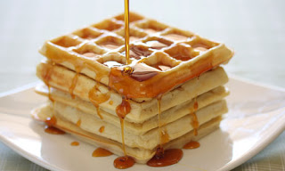
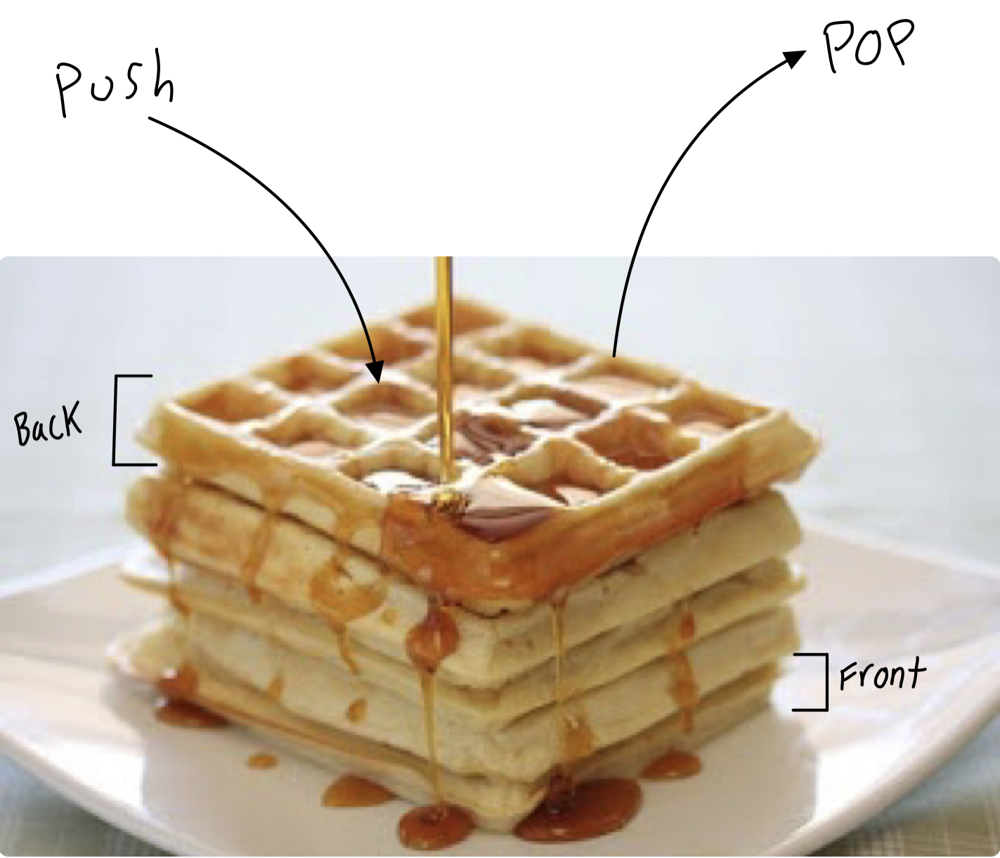
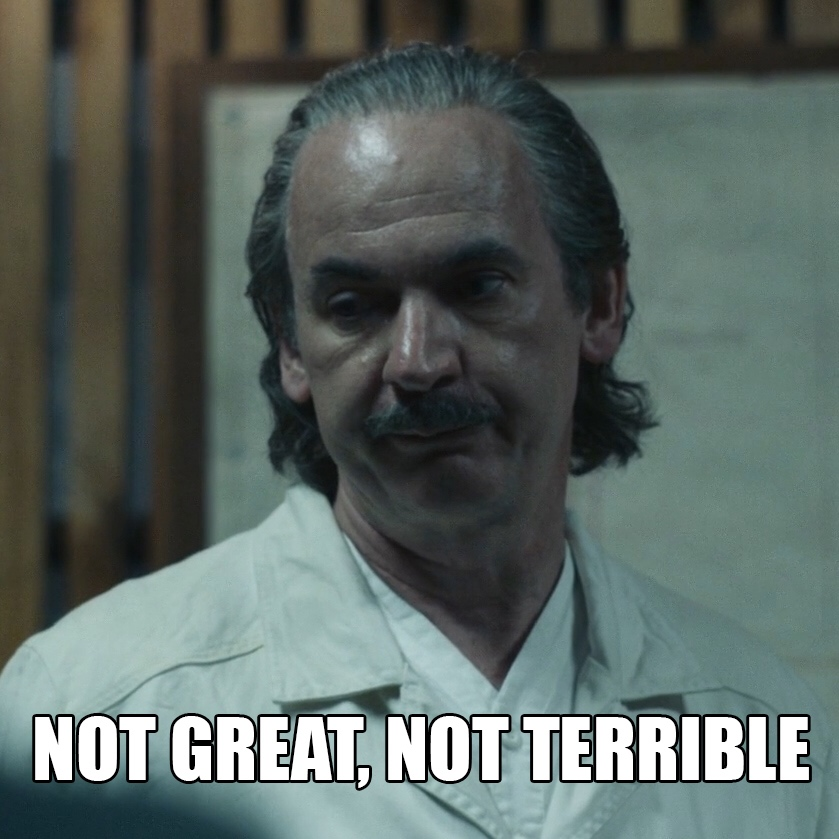

<center> 
<h1>Stacks </h1> 
</center>

Boom!! You've been hit in the head again by your captor. He yells again, "What is the performance of a stack data structure in Python?" You yell back, "I don't know! I didn't read Tanner's tutorial he made for his final project in CSE 212!" 

Well thank goodness you didn't make the same mistake as that guy! In this tutorial, we will be going over everything you could possibly need to know about stacks that will help you in any life or death situation. 

Okay, maybe not every life or death situation... the important ones for sure though.


## So wait... stacks? Like a stack of books? Money? Haystacks perhaps?

### Well sort of... let's use a tastier example. How bout a stack of waffles?



So when we are given a big heaping plate of waffles, where do we grab from? You would have to be some sort of psycho to grab from the bottom of the stack. No, we would grab from the top and proceed down from there. This is the same concept for stacks!


A **stack** is a data structure that is characterized by the order in which items are added and removed. We also use (LIFO) which means last in first out, which is also the nickname my friends gave me in baseball.

So as we are adding waffles to our plate we call this a **push**. When we take them off the plate to eat, this is called a **pop**. Easy enough so far? Good, let's keep going.


Let's see what these looks like in code:

```python
wafflestack.append(1) #This is a "push". Adds 1 waffle to the stack.
```

```python
value = wafflestack.pop() #This is a "pop". Takes off the last waffle from the stack and returns its value.
```
Conviently we can also use ```size()``` and ```empty()``` to return the size of the stack and if the stack is empty or not.

**The main point in *stacks* is that they are useful when we need to maintain history and perform an operation.**

Consider the *undo* operations we commonly see in our applications. You know the one where you are playing solitaire and you messed up about 5 moves ago and you want to go redo that part because you are stuck.

Or how bout when you are working on a word document and decide to insert a picture and now your formatting is messed up, your text is all over the place, you now have a virus, your girlfriend stops calling you, and your hot pocket is still cold in the midle. It's all good though because you hit CTRL-Z and you are back in business.

## **Performance**

Let's talk a bit about performance of stacks. 

|Stack Operation| Performance|
|---------------|-------------|
|```Push(value)```| O(1)        |
|```Pop()``` | O(1)|
|```size()```| O(1) |
|```empty()```| O(1)|

The best way to describe it is like this: (Just because its constant)



Hmmm but wait, what if we had to go through all the waffles to get to the bottom one which had chocolate chips in it? That wouldn't be great performance, in fact it would be O(n). For that instance we wouldn't want to use a stack data structure for everything but there are some great applications where we would like to use stacks. Lets try doing some examples.

## **Example**
Lets say we wanted to add some different flavors to our waffle stack. The code would look something like this:
```python
waffleStack = [] #creating a new stack

waffleStack.append('blueberry') #These are like push
waffleStack.append('chocolate')
waffleStack.append('coconut')

print(waffleStack) #Will look like this: ['blueberry', 'chocolate', 'coconut']

waffleStack.pop() #Taking off the coconut waffle
wafflestack.pop() #Taking off the chocolate waffle
waffleStack.pop() #Taking off the blueberry wafffle

print(waffleStack) #the stack is now empty, all the waffles are gone :(
```

Pretty easy right? Glad you think so because now it's your turn. Don't worry I've created some starter code for you, we are just interested in implementing *stacks* to finish the problem up!

* [Stacks Problem](stacksProblem.py)
* [Stacks Problem Solution](stacksProblemSolution.py)

Once you are finished compare your answers to the provided solution.

## Congrats you finished the Stacks Tutorial!