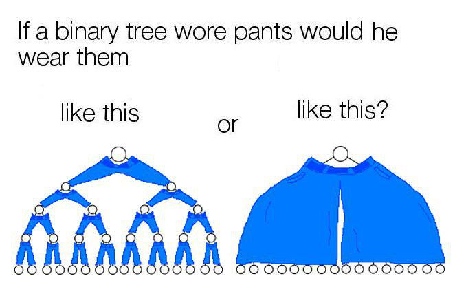

<center>
<h1> Trees </h1>
</center>

You can't take it anymore, this question has been eating at you for most of your programming life. You search endlessly on the internet for hours but it is impossible to come to a conclusion. The question is:



I don't need sleep, I need answers.

Alright let's talk a little bit about Trees but ideally <strong>Binary Trees</strong>. A Binary Tree is a non-linear data structure that is used for searching and data organization. 

The tree has nodes and each node is a data component. The top node is the <strong>root</strong> node and a node that has connected nodes is known as the <strong>parent</strong> node. The nodes connected to the parent are known as the <strong>child </strong> nodes. A <strong>leaf</strong> node is when a node has no other nodes connected to it. Let's look at this beautiful drawing:


Easy enough so far? Good let's keep going.

Now, how do we go about putting data into this data structure? Let's go through some steps:
 * Data is placed into the BST(Binary Search Tree) by comparing the data with the value in the parent node.
  * If the data is <strong>greater than</strong> the parent node that it is put into the right subtree.
 * If the data is <strong>less than</strong> the parent node, then it is put into the left subtree
 * If duplicates are allowed than the duplicated can be in the left or right subtree of the root.

 ## Balanced VS Unbalanced
 These trees are great for looking things up and we get great performance too! O(log n)! (More on that in a little bit). However this is only the case if the tree is "balanced" as we call it. When a tree becomes unbalanced then we run into performance issues. O(n) :( at this point we should just use a different data structure. Let's see what an unbalanced tree looks like:

 

 Notice how every subsequent number is just bigger than the other? This is what happens in an unbalanced tree, so try to avoid this. There are much better data structures if you just wanted to do this. 

 ## Node Class

 There are a couple of things that need to be done to begin working with trees, one of those things is initializing a node class

 ```python
class Node: #defines the structure of the node
    def __init__(self, data):
        self.data = data #the data in the node
        self.right = None #right side
        self.left = None #left side
 ```
 Once we are done with that we can initialize our binary tree. Yeah!

   ```python
class Node: #defines the structure of the node
    def __init__(self, data):
        self.data = data #the data in the node
        self.right = None #right side(child)
        self.left = None #left side(child)

root = Node(10) #this is our root number
root.left = Node(24) #left side(child)
root.right = Node(67) #right side(child)
 ```
Now our tree is looking something like this:


## Recursion

Recursion is fundamental in truly understanding binary trees. I won't go into depth here in this tutorial but we will go over it briefly to solidify understanding.

Basically, a recursion function is a function that calls itself within itself. Kind of like inception but with a better ending. Take this simple example:

```python
def hello_world_forever():
    print("Hello World")
    hello_world_forever() #This is the recursive call
```
Careful though! We really don't want to put this in our program and run it because it will crash. Luckily most IDE's look for this kind of thing and stop us from making fools of ourselves. Thanks smart programmers!

There are "Rules of Recursion" that we must follow when dealing with these functions:

1. Create a "Smaller Problem"

2. Create a "Base Case

Implementing these rules we can come up with this:
```python
def hello_world_forever():
    if count <= 0: #Base case, lets us exit the function
        return
    else:
        print("Hello World")
        hello_world_forever(count - 1) #smaller problem
```
Alright, now that we got that out of the way let's trying working out an example problem:

A binary tree is what we consider a "non-linear data structure" which means there is more than one way to traverse through the data. In this example problem we go "inorder" fashion.

```python
class Node: #defines the structure of the node
    def __init__(self, data):
        self.data = data #the data in the node
        self.right = None #right side
        self.left = None #left side

    def insert(self, data): #this will help us put all the numbers in the right order
        if self.data:
            if data < self.data: #if its less than
                if self.left is None: #reach the end
                    self.left = Node(data)
                else:
                    self.left.insert(data)
            elif data > self.data: #if its greater than
                if self.right is None: #reach the end
                    self.right = Node(data)
                else:
                    self.right.insert(data)
        else:
            self.data = data

    def printTheTree(self): #this will print the tree(Obviously)
        if self.left:
            self.left.printTheTree()
        print(self.data),
        if self.right:
            self.right.printTheTree()

    def inorder(self, root):
        #this is where we start coding:
        #this is our inorder traversal
        #the order goes from left, to root, to right
        newList = [] #need somewhere to put the information
        if root:
            newList = self.inorder(root.left)
            newList.append(root.data)
            newList = newList + self.inorder(root.right)
        return newList

root = Node(10) #this is our root number
root.insert(24)
root.insert(67)
root.insert(19)
root.insert(6)
root.insert(31)
root.insert(25)
print(root.inorder(root))
# Expected output:
# [6, 10, 19, 24, 25, 31, 67]
```
Getting it so far? Good we will give you a chance to do it yourself now! You will be asked to do a "Pre-order Traversal" and a "Post-order Traversal"

The problem can be found down below. Once you are done compare your answers to the solution provided and making any adjustments you need.

* [Tree Problem](treeProblem.py)
* [Tree Problem Solution](treeProblemSolution.py)

## Congrats! You finished the Trees Tutorial!
